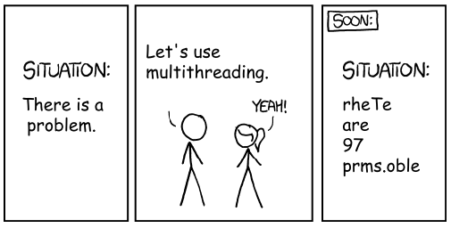

# Links

- Slides: https://quinnasena.github.io/fst/fst_slides.html#1
- fst ducumentation: https://cran.r-project.org/web/packages/fst/fst.pdf
- tidyfst ducmentation: https://cran.r-project.org/web/packages/tidyfst/tidyfst.pdf
- Detailed info: https://www.r-bloggers.com/lightning-fast-serialization-of-data-frames-using-the-fst-package/
---

# The problem

.pull-left[

- 10 treatments applied to origin dataframe

- Second level of another 10 treatments = 100 treatments

- Third level of 10 treatments = 1000 (total 1111 dataframes)

- Each dataframe is 4750 rows (total = 5277250 rows)

- Multiplied by 100 replicates...

- All of the treatments need to be analysed

]


.pull-right[
```{r dendro, echo=FALSE, message=FALSE, fig.width=6, fig.height=6,fig.show='hold'}
library(ggraph)
library(igraph)
library(microbenchmark)
library(tidyverse)
library(fst)
library(tidyverse)
library(tidyfst)

# create an edge list data frame giving the hierarchical structure of your individuals
d1 <- data.frame(from="origin", to=paste("group", seq(1,10), sep=""))
d2 <- data.frame(from=rep(d1$to, each=10), to=paste("subgroup", seq(1,100), sep="_"))
#d3 <- data.frame(from=rep(d2$to, each=100), to=paste("sub_subgroup", seq(1,1000), sep="_"))
edges <- rbind(d1, d2)
 
# Create a graph object 
mygraph <- graph_from_data_frame( edges )
 
# Basic tree
ggraph(mygraph, layout = 'dendrogram', circular = FALSE) + 
  geom_edge_diagonal() +
  geom_node_point() +
  theme_void()
```
]


---

# The problem

- Origin dataframe (with all treatments) = 18 Gb

- Analysis of model = 45 Gb output

- Further analysis needs to read in 45 Gb data and do further computations

- in R subsetting dataframes creates a copy of the original dataframe, both of which are stored in RAM.

- Impossible on my personal laptop and an inefficient use of resources from NeSI


---

# Hello fst


```{r}
### Create something big(ish) 30000 rows, 200 variables plus an alphabetical id column
a_lot_of_data <- as.data.frame(
  matrix(
    rnorm(3000000),
    nrow = 30000,
    ncol = 200
  )
) %>% 
  mutate(id = rep(LETTERS[1:20], each=1500))

### How big?
print(object.size(a_lot_of_data), units = "Mb")
### Save as RDS and as FST
saveRDS(a_lot_of_data, "a_lot_of_data.Rds")
fst::write.fst(a_lot_of_data, "a_lot_of_data.fst")
```


---

# Write speed

.pull-left[
## Rds
```{r}
write_speed_rds <- microbenchmark(
  saveRDS(a_lot_of_data, "a_lot_of_data.rds"),
  times = 1
)
# speed in GB/s
as.numeric(object.size(a_lot_of_data)) / write_speed_rds$time

# speed in seconds
write_speed_rds$time/1e9
```
]

.pull-right[
## fst
```{r}
write_speed_fst <- microbenchmark(
  write_fst(a_lot_of_data, "a_lot_of_data.fst"),
  times = 1
)
# speed in GB/s
as.numeric(object.size(a_lot_of_data)) / write_speed_fst$time

# speed in seconds
write_speed_fst$time/1e9
```
]


---
# Size matters, the smaller the better...

```{r}
### Read in both formats
a_lot_of_data_rds <- readRDS("a_lot_of_data.rds")
a_lot_of_data_fst <- fst("a_lot_of_data.fst")
```
--
```{r}
### How Big are they now?
## Rds, same as original
print(object.size(a_lot_of_data_rds), units = "Mb")
## fst, a lot smaller than original
print(object.size(a_lot_of_data_fst), units = "Kb")

```

---
# Subsetting Rds

```{r}
### With Rds format we read in the entire dataframe and subset
subset_rds <- a_lot_of_data_rds[a_lot_of_data_rds$id == "E",  c("V98", "id")]
print(object.size(subset_rds), units = "Kb")
head(subset_rds)

## Size total = 30.2 Kb + 46 Mb
```
---

# Subsetting fst
```{r}
### fst subsets *without* reading entire dataframe into memory
subset_fst <- a_lot_of_data_fst[a_lot_of_data_fst$id == "E",  c("V98", "id")]
head(subset_fst)
print(object.size(subset_fst), units = "Kb")

## Size total = 16.3 Kb + 24.3 Kb
```

---

# Read fst
```{r}
### fst can read-in part of a dataset but I think it only takes row numbers as an argument
read_subset_fst <- read_fst("a_lot_of_data.fst", c("id","V98"), 1000, 2000)
head(read_subset_fst)
print(object.size(read_subset_fst), units = "Kb")

## Size total = 16.6 Kb
```


---
# tidyfst

- fst does not handle like a regular dataframe (although can be converted after subsetting)

```{r}
### Subsetting can also be done with tidyfst package that replicates some tidyverse functions
subset_tidyfst <- filter_dt(a_lot_of_data_fst, id == "C") %>% 
  select_dt(V98, id) #the tidyfst way of filtering fst data tables
head(subset_tidyfst)  
```

---

# Pros and cons

.pull-left[
## Rds

- Capable of saving a list of outputs as one object (fst seems to only save a single object)

- Saved output read back in same format, i.e., class (df, matrix...)

\----------
<br>


- Slower to read/write

]


.pull-right[
## fst

- Can save huge amounts of memory!

- read/write is much much faster than any other package

<br>
\----------
<br>

- Reads back as fst format which handles like a data.table rather than data.frame

- I still save Rds as well as fst.

]


---
# (ง°ل͜°)ง
```{r, echo=FALSE, fig.align='center'}

```


